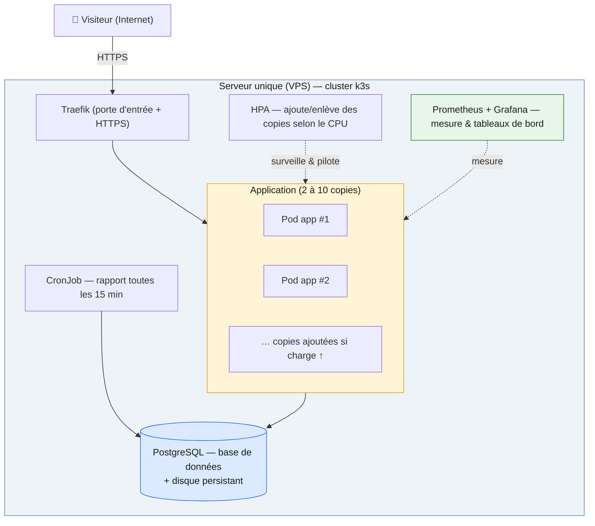

# Soutenance — Déploiement Cloud « Coupe du Monde 2026 »

**Dépôt GitHub :** <https://github.com/Ynov-Alan-Projects/capstone-dplc-student>

> Support général de l'oral (≈ 35 min). Objectif : présenter notre solution,
> **expliquer et justifier chaque choix** dans un langage accessible, puis
> faire les démonstrations en direct (montée en charge, panne provoquée).
>
> Documents détaillés associés : [`OPTIMISATION.md`](OPTIMISATION.md) (Dockerfile),
> [`docs/job-design.md`](docs/job-design.md) (le Job), [`docs/architecture.md`](docs/architecture.md),
> [`infra/RUNBOOK.md`](infra/RUNBOOK.md) (procédures).

---

## 0. La mission en une phrase

La FIFA veut moderniser le site de suivi de la Coupe du Monde 2026. On nous
fournit une application toute simple (un seul programme + une base de données)
et on nous demande de l'héberger « dans le cloud » de façon à ce qu'elle
**tienne la charge** d'un pic de visiteurs, qu'elle **se répare toute seule**
en cas de panne, et qu'on puisse **voir ce qu'il se passe** à l'intérieur.

**Notre réponse en une phrase :** on a emballé l'application dans un conteneur
propre, on l'a déployée sur un **cluster Kubernetes** capable de lancer
plusieurs copies de l'app, d'en **ajouter automatiquement** quand il y a du
monde, et d'en **relancer une** instantanément si elle tombe — le tout pour
**~40 €/mois**.

---

## 1. Mini-glossaire (pour suivre sans être expert)

| Terme | Traduction « simple » |
|---|---|
| **Conteneur** (Docker) | Une « boîte » qui contient l'application **et** tout ce dont elle a besoin pour tourner. On la lance à l'identique partout. |
| **Image** | Le « modèle » figé à partir duquel on crée des conteneurs (comme un moule). |
| **Kubernetes (k8s)** | Le « chef d'orchestre » qui lance, surveille, relance et multiplie les conteneurs automatiquement. |
| **k3s** | Une version **allégée** de Kubernetes, idéale pour une seule machine. |
| **Pod** | La plus petite unité que Kubernetes gère : en pratique, **une copie de notre application** qui tourne. |
| **Réplica** | Une copie supplémentaire de l'app. Plusieurs réplicas = on encaisse plus de visiteurs et on survit si l'une tombe. |
| **Helm** | Le « gestionnaire de paquets » de Kubernetes : un seul fichier décrit toute l'installation, rejouable à l'identique. |
| **Probe** (sonde) | Un petit contrôle de santé automatique : « est-ce que l'app répond ? est-elle prête ? ». |
| **HPA** (autoscaler) | Le mécanisme qui **ajoute ou enlève des copies** de l'app selon la charge (le « thermostat »). |
| **Prometheus / Grafana** | Les outils qui **mesurent** (Prometheus) et **affichent** (Grafana) ce qui se passe : nombre de requêtes, temps de réponse… |
| **CI/CD** | La chaîne automatique qui, dès qu'on modifie le code, **teste, fabrique et déploie** tout seul. |

---

## 2. L'application de départ (ce qu'on nous a donné)

- Une application **Node.js / Express** (un seul programme web) + une base de
  données **PostgreSQL**. Thème : Coupe du Monde 2026 (48 équipes, matchs, votes).
- Elle expose des « routes » (adresses web) : page d'accueil, vote, résultats,
  un point de **mesure** (`/metrics`), un calcul volontairement gourmand
  (`/api/compute`) et un bouton de **panne simulée** (`/api/admin/kill`).
- **Contrainte imposée : ne pas modifier les routes** (elles servent à la
  notation automatique). → On a tout construit **autour** de l'app, sans
  toucher à son comportement.

> Ces deux dernières routes ne sont pas là par hasard : `/api/compute` sert à
> **prouver la montée en charge**, et `/api/admin/kill` à **prouver l'auto-réparation**.

---

## 3. Vue d'ensemble de l'architecture



**En résumé :** un visiteur arrive par HTTPS, Traefik le dirige
vers **une des copies** de l'app, l'app lit/écrit dans la base. En parallèle,
l'autoscaler ajuste le nombre de copies, le monitoring observe tout, et un job
planifié génère des rapports.

---

## 4. Mission 1 — Le Dockerfile optimisé

**Le problème :** le Dockerfile fourni contenait **5 mauvaises pratiques**
(image énorme et non figée, application qui tourne en « super-utilisateur »,
fabrication en une seule étape, pas de filtre de fichiers, mauvais ordre des
opérations qui casse le cache).

**Ce qu'on a fait (résumé) :**

| Avant | Après | Bénéfice « parlant » |
|---|---|---|
| `node:latest` (~1,1 Go, version qui bouge) | `node:20-alpine` figée | Image **5× plus petite (~205 Mo)**, builds reproductibles |
| Tourne en **root** | Tourne en **utilisateur limité** (uid 1000) | Beaucoup plus **sûr** en cas de piratage |
| Fabrication 1 étape | **Multi-étapes** | Outils de fabrication **exclus** de l'image finale |
| Pas de `.dockerignore` | Filtre ajouté | On n'embarque pas `.git`, tests, etc. |
| Mauvais ordre + `npm install` | Bon ordre + `npm ci` | Builds **plus rapides** et **identiques** à chaque fois |

> Résultat vérifiable : le script de contrôle du barème affiche **5/5**.
> Détails complets et justifications → [`OPTIMISATION.md`](OPTIMISATION.md).

**Pourquoi ça compte :** une image plus petite = déploiement plus rapide,
moins de surface d'attaque, moins de coût de stockage. Un conteneur non-root =
exigence de sécurité de base en production.

---

## 5. Mission 2 — Le déploiement cloud : nos choix, justifiés

### 5.1 Pourquoi Kubernetes (et pas « juste un serveur ») ?

On nous demande **haute disponibilité, élasticité, auto-réparation**.
Kubernetes fait **nativement** ces trois choses : lancer plusieurs copies,
en ajouter sous charge, en relancer une qui tombe. Le faire « à la main »
sur un serveur classique demanderait beaucoup de scripts fragiles.

### 5.2 Pourquoi un VPS + k3s (et pas AWS managé) ? — le choix FinOps

| Option | Coût indicatif | Notre lecture |
|---|---|---|
| Kubernetes **managé** (AWS EKS…) | ~250–300 €/mois | Le plus robuste, mais hors budget projet |
| **VPS unique + k3s** ✅ | **~40 €/mois** | ~6× moins cher, on garde la maîtrise complète |

**k3s** est une distribution Kubernetes allégée, parfaite pour **un seul
serveur**. Elle intègre déjà la porte d'entrée (Traefik), le stockage de
disque et la mesure de charge.

> **Trade-off assumé :** un seul serveur = **point de panne
> unique au niveau machine**. C'est un choix **budgétaire conscient**. La haute
> disponibilité qu'on démontre est **au niveau de l'application** (plusieurs
> copies, sondes de santé, redémarrage auto). Passer en multi-serveurs serait
> la première évolution si le budget le permettait.

### 5.3 Helm — pour une installation reproductible

Au lieu d'installer les composants un par un, on décrit **toute
l'installation dans un seul « paquet » Helm** (13 éléments : l'app, la base,
l'autoscaler, la porte d'entrée, le HTTPS, le monitoring, le job…).
**Bénéfice :** on peut tout réinstaller à l'identique avec **une commande**,
et revenir en arrière (`rollback`) en cas de souci.

### 5.4 Traefik + nip.io — rendre le site accessible sur Internet

- **Traefik** (inclus dans k3s) est la **porte d'entrée** : il reçoit le
  trafic Internet et le dirige vers les copies de l'app.
- **nip.io** nous donne une **adresse web gratuite** basée sur l'IP du
  serveur (`worldcup.<IP>.nip.io`), sans acheter de nom de domaine.

### 5.5 HTTPS automatique (cert-manager + Let's Encrypt)

Le site est en **HTTPS** avec un **vrai certificat gratuit** Let's Encrypt,
renouvelé automatiquement. **Bénéfice :** trafic chiffré, cadenas dans le
navigateur, zéro intervention manuelle.

### 5.6 La base de données dans le cluster (StatefulSet + disque persistant)

La base PostgreSQL tourne **dans le cluster**, avec un **disque qui survit**
aux redémarrages du conteneur (les données ne sont pas perdues). On utilise un
**StatefulSet** car une base a besoin d'une identité stable et d'un stockage
attaché — contrairement à l'app, qui elle est « jetable et multipliable ».

> **Trade-off :** héberger la base soi-même coûte moins cher qu'une base
> managée, mais demande plus d'attention (sauvegardes, mises à jour). Pour la
> suite : sauvegardes automatiques + éventuellement une base managée.

---

## 6. Les 4 exigences techniques (le cœur de la note + les démos)

### 6.1 Haute disponibilité — /5 (design)

- **Minimum 2 copies de l'app en permanence** : si l'une tombe, l'autre
  répond → pas de coupure visible.
- **Rolling update** : lors d'une mise à jour, les copies sont remplacées
  **une par une**, sans interruption.
- **PDB (budget de disruption)** : Kubernetes ne peut **jamais** retirer
  toutes les copies en même temps lors d'une opération de maintenance.

### 6.2 Élasticité / auto-scaling — /4

**Le principe :** un « thermostat » (HPA) surveille l'usage du processeur.
Au-delà de **60 %** d'utilisation, il **ajoute des copies** (jusqu'à 10) ;
quand la charge retombe, il **revient à 2**.

**Résultats observés lors de nos tests :**
> On envoie beaucoup de trafic sur `/api/compute` (calcul gourmand).
> CPU : **2 % → 222 % → 330 %**. Copies : **2 → 4 → 8**. Puis retour à **2**
> une fois la charge terminée (Kubernetes attend quelques minutes avant de
> réduire, pour éviter les oscillations).

### 6.3 Résilience / auto-réparation — /3 (objectif : reprise < 15 s)

**Deux sondes de santé sur chaque copie :**
- **Liveness** (`/api/health`) : « l'app est-elle vivante ? » Si non →
  Kubernetes la **relance**.
- **Readiness** (`/api/health/db`) : « est-elle prête à recevoir du trafic
  (base accessible) ? » Si non → on **ne lui envoie pas** de visiteurs.

**Arrêt propre (graceful shutdown) :** quand une copie est arrêtée, elle
**termine les requêtes en cours** et **ferme proprement** la connexion à la
base avant de s'éteindre → pas de requête coupée net.

**Résultats observés lors de nos tests :**
> On appuie sur le « bouton panne » (`/api/admin/kill`) : la copie ciblée
> s'éteint, Kubernetes la **relance en ~6 s** (< 15 s exigées). Pendant
> l'incident, on envoyait 50 requêtes : **49 réussissent**, **1 seule échoue**
> à l'instant exact de la panne — l'autre copie a assuré la continuité.

### 6.4 Observabilité — /2 (avec FinOps)

- **Prometheus** collecte automatiquement les métriques de l'app (via
  `/metrics`) : nombre de requêtes, temps de réponse…
- **Grafana** affiche un **tableau de bord dédié** « World Cup App » :
  requêtes/seconde, temps de réponse, nombre de copies, redémarrages.
- **Bénéfice :** en cas de problème, on **voit** immédiatement où ça coince,
  au lieu de deviner.

---

## 7. Sécurité (transversal — exigé par le sujet)

| Mesure | En clair |
|---|---|
| **Conteneur non-root** (uid 1000) | L'app n'a pas les pleins pouvoirs → dégâts limités si piratée |
| **Secrets injectés au démarrage** | Les mots de passe (base de données…) **ne sont jamais écrits dans le code ni dans Git** |
| **HTTPS Let's Encrypt** | Tout le trafic est chiffré |
| **Image privée** (registre GHCR) | Notre image n'est pas téléchargeable par n'importe qui |

> Point d'attention : après le projet, il faut **révoquer les jetons d'accès**
> créés pour la démo et réduire leurs droits au minimum.

---

## 8. FinOps — l'estimation chiffrée

| Poste | Solution managée (réf.) | Notre solution |
|---|---|---|
| Cluster + machine | ~250–300 €/mois | **VPS ~40 €/mois** |
| Nom de domaine | ~10 €/an | **0 €** (nip.io) |
| Certificat HTTPS | parfois payant | **0 €** (Let's Encrypt) |
| Monitoring | souvent payant | **0 €** (Prometheus/Grafana open-source) |
| **Total** | **~250–300 €/mois** | **~40 €/mois (≈ 6× moins cher)** |

**Synthèse :** on a privilégié le **rapport qualité/prix** pour un projet
étudiant, en assumant le compromis « un seul serveur » et en gardant une
architecture **prête à grandir** (il suffirait d'ajouter des serveurs).

---

## 9. Mission 3 — Le Job (traitement planifié qui lit la base)

**Ce qu'il fait, en clair :** toutes les **15 minutes**, un petit programme se
réveille, lit les matchs et les votes, **recalcule le classement de chaque
groupe** et **désigne l'équipe préférée du public** (la plus votée), puis
**enregistre un rapport horodaté** dans la base.

**Pourquoi c'est pertinent :** ces calculs sont faits **en dehors** des pages
web → le site reste rapide même sous charge, et on garde un **historique** des
rapports.

**Comment c'est construit :** un **CronJob Kubernetes** qui réutilise **la
même image** que l'app. Il peut aussi être **déclenché à la demande** (ex. à la
fin d'un match) en une commande.

> Diagramme détaillé, modèle de données et justifications →
> [`docs/job-design.md`](docs/job-design.md).

---

## 10. Bonus — CI/CD (livraison automatique)

Dès qu'on pousse du code sur la branche principale, une chaîne **GitHub
Actions** se déclenche automatiquement :

```
1. TEST       → lance les tests (11/11 doivent passer)
2. BUILD/PUSH → fabrique l'image et l'envoie sur le registre (GHCR)
3. DEPLOY     → met à jour le cluster (helm upgrade) à distance
```

**Bénéfice :** plus de déploiement manuel risqué. Le cluster passe tout seul
sur la nouvelle version, identifiée par le numéro de commit.

---

## 11. Recul critique — limites & axes d'amélioration

1. **Un seul serveur = point de panne machine.** Choix budgétaire assumé. →
   Évolution : 2–3 serveurs (vraie haute dispo, multi-nœuds).
2. **Base auto-hébergée** → ajouter **sauvegardes automatiques** ; à terme,
   base managée.
3. **Alerting** : on a la mesure (Grafana), il manque des **alertes
   automatiques** (ex. « temps de réponse trop élevé → notification »).
4. **Secrets** : gérés via Kubernetes ; un coffre dédié (Vault) serait mieux à
   grande échelle.
5. **Tests de charge** ponctuels → les industrialiser dans la CI.

---

## 12. Déroulé de la soutenance (≈ 35 min) + script de démo

| Phase | Durée | Contenu |
|---|---|---|
| **Présentation** | ~10 min | Sections 0 → 5 : mission, archi, choix techniques, FinOps |
| **Démo technique** | ~10 min | URL publique en HTTPS, état du cluster, tableau de bord Grafana, pipeline CI/CD |
| **Crash tests** | ~15 min | Montée en charge + panne provoquée en direct (sections 6.2 / 6.3) |

**Commandes pour la démonstration :**

```bash
# 0. Le site est en ligne (HTTPS)
#    https://worldcup.178.170.25.118.nip.io   et   /metrics

# 1. État du cluster (copies, autoscaler, base, porte d'entrée)
kubectl -n worldcup get pods,hpa,svc,ingress

# 2. ÉLASTICITÉ — on met sous charge, on regarde les copies grimper
HOST=worldcup.178.170.25.118.nip.io infra/loadtest.sh   # trafic sur /api/compute
kubectl -n worldcup get hpa -w                           # CPU ↑ et replicas 2→4→8

# 3. RÉSILIENCE — on provoque une panne, on regarde la reprise (<15 s)
curl -X POST https://worldcup.178.170.25.118.nip.io/api/admin/kill
kubectl -n worldcup get pods -w                          # RESTARTS 0→1, Ready en ~6 s

# 4. JOB — on déclenche un rapport à la demande
kubectl -n worldcup create job --from=cronjob/worldcup-report demo-report
kubectl -n worldcup logs job/demo-report                 # Report #N… / Favourite team: …

# 5. OBSERVABILITÉ — tableau de bord
#    https://grafana.178.170.25.118.nip.io  (dashboard « World Cup App »)
```

---

## 13. Précisions techniques fréquentes (FAQ)

**« Pourquoi un seul serveur ? Ce n'est pas de la haute dispo ! »**
> Choix budgétaire assumé (~40 € vs ~250 €). La haute dispo est **au niveau
> application** : 2+ copies, sondes, redémarrage auto, PDB. La machine unique
> est notre limite n°1, et la première évolution serait le multi-serveurs.

**« Que se passe-t-il si la base tombe ? »**
> La sonde *readiness* (`/api/health/db`) détecte que la base est injoignable
> → les copies sont retirées du trafic jusqu'au retour de la base. Les données
> survivent grâce au **disque persistant**.

**« Comment l'autoscaler décide-t-il ? »**
> Il regarde l'usage **CPU moyen**. Au-dessus de **60 %**, il ajoute des
> copies (max 10) ; en dessous, il réduit (min 2), avec un délai
> anti-oscillation.

**« Vos secrets sont-ils dans Git ? »**
> Non. Les mots de passe sont injectés **au démarrage** via des Secrets
> Kubernetes, jamais écrits dans le code ni dans l'image.

**« Pourquoi un temps de reprise de ~6 s et pas 0 ? »**
> Le temps que Kubernetes détecte la panne (sonde) + relance le conteneur +
> que l'app soit « prête ». Pendant ce temps, **l'autre copie répond** → le
> visiteur ne voit quasiment rien (49/50 requêtes OK dans notre test).

**« Avez-vous modifié l'application ? »**
> **Aucune route modifiée** (contrainte respectée). On a seulement ajouté un
> **arrêt propre** (graceful shutdown) et tout construit **autour** de l'app.

---

## 14. Récapitulatif vs barème (/20)

| Critère | Pts | Couvert par |
|---|:--:|---|
| Soutenance & maîtrise orale | 6 | Ce document + démos live + réponses (section 13) |
| Choix architecturaux & design | 5 | Helm reproductible, conteneur non-root, multi-étapes, sondes (sections 4–5) |
| Élasticité & auto-scaling | 4 | HPA CPU 2→10, démo de charge (6.2) |
| Résilience & self-healing | 3 | Sondes + reprise ~6 s, PDB, disque persistant (6.3) |
| Observabilité & FinOps | 2 | Prometheus/Grafana + ~40 € vs ~250 € (6.4, 8) |
| **Bonus** Job + CI/CD | +2 | CronJob (section 9) + GitHub Actions (section 10) |

**Synthèse :** la plateforme livrée est **disponible, élastique, capable de se
réparer seule et observable**, pour **~40 €/mois**, sans modification du
comportement de l'application ; ses limites et ses pistes d'évolution sont
identifiées (sections 6 et 11).
