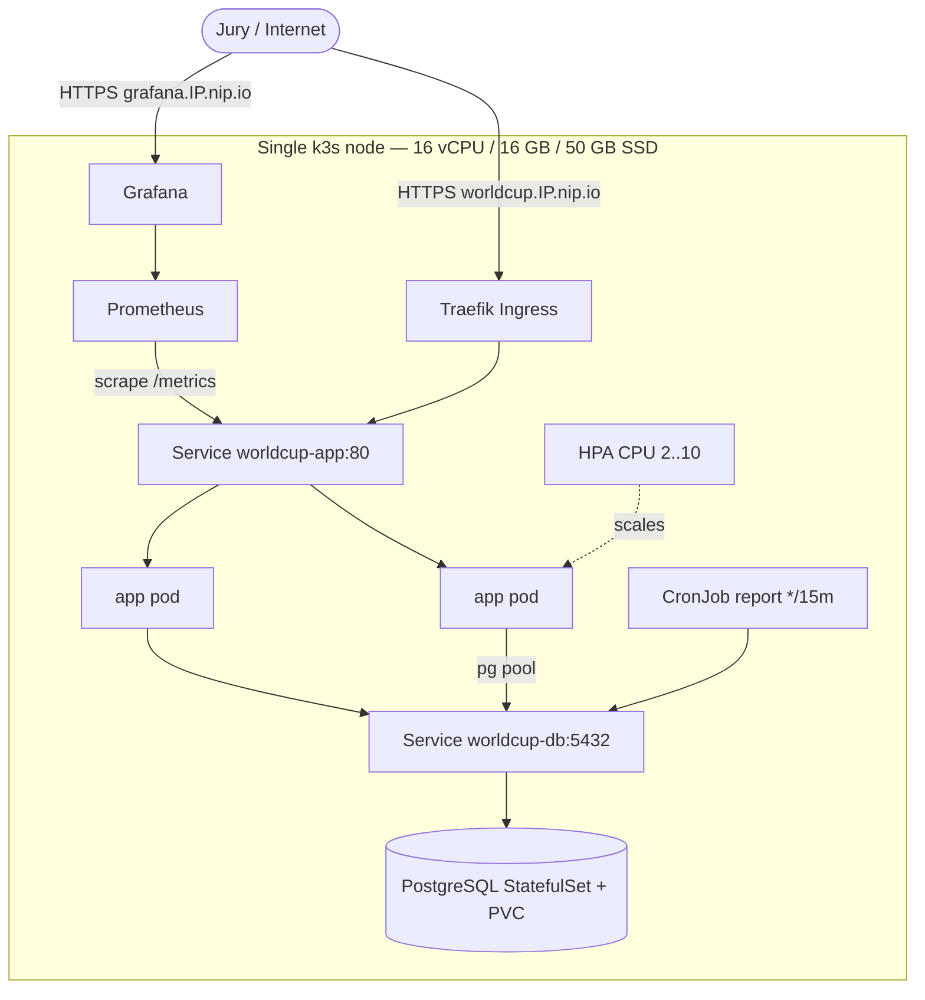

# Architecture — World Cup 2026 sur k3s (mono-nœud, VPS Ikoula)

**Légende :** flèches pleines = trafic requête ; pointillé = action de scaling. Tout réside sur un seul nœud k3s (SPOF nœud assumé — choix FinOps). HA au niveau pod via replicas + probes ; self-healing via restart kubelet sur `/api/admin/kill`.

## Flux de données

1. Le jury/navigateur tape `https://worldcup.<IP>.nip.io` → Traefik route vers le Service `worldcup-app`.
2. Le Service répartit (round-robin) sur les pods app (2 à 10 selon le HPA).
3. Chaque pod interroge PostgreSQL via le Service headless `worldcup-db` (pool `pg`).
4. PostgreSQL persiste sur un PVC local-path (survit aux redémarrages de pod).
5. Le CronJob `worldcup-report` lit la base toutes les 15 min et écrit un snapshot dans la table `reports`.
6. Prometheus scrape `/metrics` de l'app (ServiceMonitor) ; Grafana lit Prometheus.

## Décisions clés

| Décision | Raison |
|---|---|
| k3s mono-nœud | Coût (1 VPS 40 €/mois), simplicité, URL publique réelle |
| HPA sur CPU | `/api/compute` sature le CPU → scale-out démontrable en live |
| Postgres in-cluster (StatefulSet) | Données minuscules, self-contained, reproductible via Helm |
| Helm | Déploiement reproductible, paramétrable, story « industrialisation » |
| Traefik + nip.io | Ingress intégré k3s, pas d'achat de domaine |
| kube-prometheus-stack | Observabilité clé en main (Prometheus + Grafana) |
