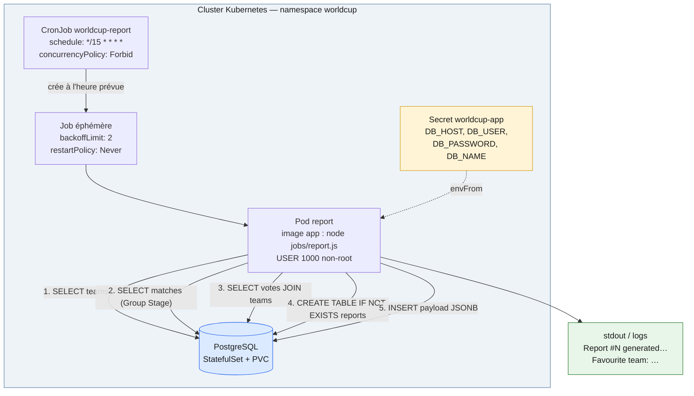
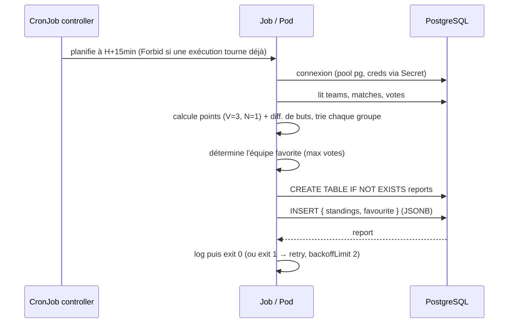

# Design du Job — « Report Job » (classements + équipe favorite)

**Dépôt GitHub :** <https://github.com/Ynov-Alan-Projects/capstone-dplc-student>

> Mission 3 du Capstone : *« Un traitement planifié ou déclenché qui lit la
> BDD. Évalué sur : existence, pertinence, originalité. »*
> Ce document décrit **le design du Job**, son **diagramme**, et sert de
> support pour **l'expliquer** à l'oral.

## 1. En une phrase

Un **CronJob Kubernetes** qui, toutes les 15 minutes, lit la base PostgreSQL
(`teams`, `matches`, `votes`), **recalcule les classements de chaque groupe**
et **détermine l'équipe favorite du public** (celle qui a le plus de votes),
puis **stocke un snapshot JSON horodaté** dans une table `reports`.

- **Code** : [`app/jobs/report.js`](../app/jobs/report.js)
- **Déploiement** : [`charts/worldcup/templates/cronjob.yaml`](../charts/worldcup/templates/cronjob.yaml)
- **Planification** : `*/15 * * * *` (paramétrable dans `values.yaml` →
  `cronjob.schedule`)

## 2. Pourquoi ce Job (pertinence & originalité)

- **Pertinent métier** : le classement et le « baromètre des fans » sont
  exactement le genre de données qu'un site de Coupe du Monde veut rafraîchir
  périodiquement, sans recalculer à chaque requête HTTP.
- **Découple le calcul lourd de la requête utilisateur** : l'agrégation se
  fait **hors du chemin critique** de l'API → l'app reste rapide même sous
  charge.
- **Réutilise l'image applicative** : pas d'image dédiée à maintenir, le Job
  lance simplement `node jobs/report.js` dans la **même image** que l'app
  (mêmes dépendances, même `Secret` de connexion DB).
- **Idempotent & traçable** : chaque exécution insère un nouveau rapport
  horodaté → on garde un **historique** (audit, comparaison dans le temps).

## 3. Diagramme



### Cycle de vie (séquence)



## 4. Données lues et produites

**Entrées (lecture seule sur le schéma existant — aucune route applicative touchée) :**

| Table | Colonnes utilisées | Usage |
|---|---|---|
| `teams` | `id, name, group_letter` | initialiser la table de classement par groupe |
| `matches` | `team_home_id, team_away_id, score_home, score_away` (stage = `Group Stage`) | calcul des points et de la différence de buts |
| `votes` | `team_id` (jointure `teams`) | comptage pour l'équipe favorite |

**Sortie — table `reports`** (créée par le Job si absente, donc auto-portante) :

```sql
CREATE TABLE IF NOT EXISTS reports (
  id           SERIAL PRIMARY KEY,
  generated_at TIMESTAMP DEFAULT NOW(),
  payload      JSONB NOT NULL          -- { standings: {...}, favourite: {...} }
);
```

**Règles de calcul des classements** : victoire = 3 pts, nul = 1 pt, défaite =
0 ; tri par points puis par différence de buts (`gf - ga`).

## 5. Choix de conception Kubernetes (à défendre à l'oral)

| Réglage (cronjob.yaml) | Valeur | Pourquoi |
|---|---|---|
| `schedule` | `*/15 * * * *` | rafraîchissement régulier sans surcharger la DB ; paramétrable |
| `concurrencyPolicy` | `Forbid` | empêche deux rapports de tourner en parallèle (cohérence, pas de double charge DB) |
| `restartPolicy` | `Never` | un échec crée un nouveau Pod plutôt que de redémarrer en boucle |
| `backoffLimit` | `2` | on retente jusqu'à 2 fois en cas d'erreur transitoire (DB momentanément indispo) |
| `successfulJobsHistoryLimit` / `failedJobsHistoryLimit` | `3` / `3` | garde un historique court pour debug, sans accumuler des Pods terminés |
| `envFrom: secretRef worldcup-app` | — | credentials DB injectés au **runtime** (jamais dans l'image / Git) |
| `image` + `imagePullSecrets` | image app | réutilise l'image applicative ; compatible registry privé GHCR |

**Sécurité** : le Pod hérite du même principe non-root (uid 1000) et des mêmes
Secrets que l'app → aucun credential en clair.

**Résilience** : `backoffLimit` + `restartPolicy: Never` + `concurrencyPolicy:
Forbid` donnent un comportement déterministe en cas d'échec ou de chevauchement.

## 6. Bonus — Job fonctionnel : CRON **et** déclenchement manuel/événementiel

Le Job est **fonctionnel** et peut être déclenché de deux façons :

**a) Planifié (CRON)** — automatique toutes les 15 min via le CronJob.

**b) À la demande (événementiel / manuel)** — on crée un Job ponctuel à partir
du CronJob, par ex. après une fin de match :

```bash
# Déclenchement manuel immédiat (réutilise le template du CronJob)
kubectl -n worldcup create job --from=cronjob/worldcup-report manual-report

# Vérifier le résultat
kubectl -n worldcup logs job/manual-report
# → Report #N generated at 2026-06-30 …
#   Favourite team: Mexico
```

> Piste d'évolution « basée sur évènements » : brancher ce même `create job
> --from=cronjob/...` sur un webhook « match terminé » ou un message de file
> (ex. via un petit listener / KEDA `ScaledJob`) — le cœur du traitement
> (`report.js`) reste identique.

## 7. Comment l'exécuter / le tester

```bash
# 1. Le CronJob est déployé avec le chart Helm
helm -n worldcup get manifest worldcup | grep -A2 'kind: CronJob'

# 2. Forcer une exécution maintenant
kubectl -n worldcup create job --from=cronjob/worldcup-report report-now
kubectl -n worldcup logs -f job/report-now

# 3. Lire le dernier rapport en base
kubectl -n worldcup exec -it sts/worldcup-db -- \
  psql -U postgres -d worldcup2026 \
  -c "SELECT id, generated_at, payload->'favourite'->>'name' AS favourite \
      FROM reports ORDER BY id DESC LIMIT 1;"
```
